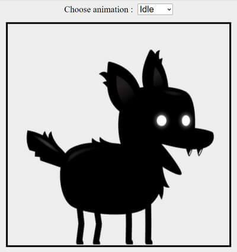

# Sprite Animation
- TypeScript and Vite version of the [Sprite animation in JavaScript video](https://youtu.be/CY0HE277IBM)
- Animates different dog sprites

## Sprites image specs
- width: 6876px and 12 columns
- 6876/12 = 573px ~575px with the margin
- height: 5230px and 10 rows
- 5230/10 = 523px
